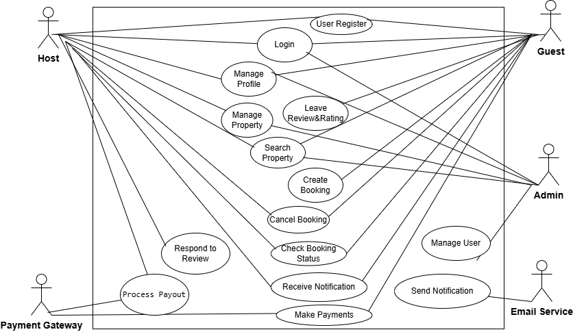

# Requirement Analysis in Software Development

This repository explains the purpose and process of **Requirement Analysis** in the Software Development Life Cycle (SDLC).  
It serves as a learning resource and documentation reference for understanding how to gather, analyze, and validate requirements to ensure successful project delivery.

---

## What is Requirement Analysis?

Requirement Analysis is the **first step in the SDLC**. It focuses on **gathering, understanding, prioritizing, and analyzing** customer requirements.  
Its main goal is to ensure a **common understanding** between the customer and the software development team, reducing risks of miscommunication and rework later in the project.

---

## Why is Requirement Analysis Important?

Requirement Analysis is critical because it:

- Provides a **clear understanding** of what the customer wants.
- Clearly **defines the scope** of the project.
- Serves as the **basis for designing and developing** the system.
- Helps **reduce risks** of project failure by identifying issues early.

---

## Key Activities in Requirement Analysis

The process of requirement analysis typically involves five key activities:

- **Requirement Gathering** – Collect requirements through interviews, questionnaires, and observations.
- **Requirement Elicitation** – Refine, clarify, and brainstorm requirements with stakeholders.
- **Requirement Documentation** – Create a detailed requirements specification document.
- **Requirement Analysis and Modeling** – Analyze requirements and create models such as Use Case Diagrams and Class Diagrams.
- **Requirement Validation** – Review documented requirements with stakeholders to ensure accuracy and completeness.

---

## Types of Requirements

### Functional Requirements

These describe **what the system should do** – the main features and functionalities.

**Examples (Booking Management System):**

- User authentication (login/logout).
- Search for hotels.
- Book a hotel room.
- Make a payment.

### Non-functional Requirements

These describe **how the system should perform** – quality attributes and constraints.

**Examples:**

- **Performance** – Search results should load within 3 seconds.
- **Security** – User passwords must be encrypted.

---

## Use Case Diagrams

Use Case Diagrams are a **visual representation of interactions** between users (actors) and the system.

**Benefits of Use Case Diagrams:**

- Provide a clear visual representation of system functionalities.
- Help in identifying and organizing system requirements.
- Facilitate communication among stakeholders and the development team.

**Booking System Use Case Diagram:**

---

## Acceptance Criteria

Acceptance Criteria define the **conditions that must be met** for a feature to be considered complete.

**Benefits of Acceptance Criteria:**

- Ensure all parties have a clear understanding of feature requirements.
- Provide a basis for testing and validation.
- Help maintain quality and meet user expectations.

**Example – Checkout Feature:**

- User logs in successfully.
- User can access the payment/checkout URL.
- User can make a payment.
- System sends a payment confirmation notification.
- User is redirected back to the original page.

---
